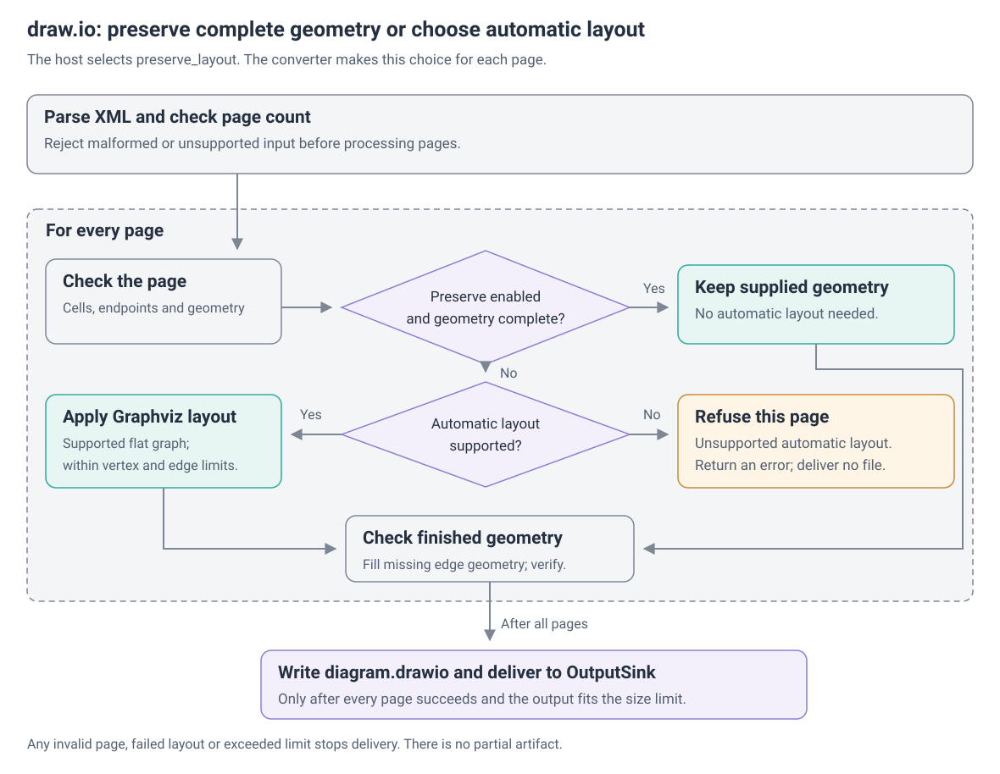
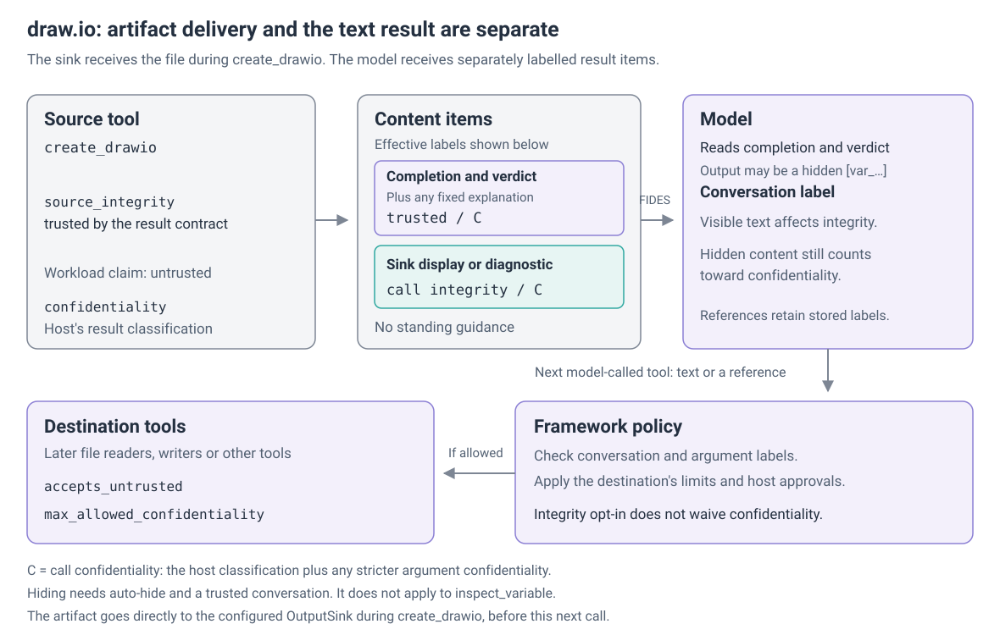

# draw.io

`create_drawio(xml: str)` validates native draw.io XML, applies the host's layout settings and produces an editable `diagram.drawio`. The host can also enable native PNG, JPG and SVG exports with `DrawioExport`. A separate `export_drawio(file: str)` tool exports an authorized stored diagram with complete geometry. The host's `OutputSink` receives the artifacts; the model receives completion, verdict and output items.

See the [package README](../../../packages/maf-sandbox-drawio/README.md) for wiring and an input example.

## Contract

| Setting | Value |
|---|---|
| Kind and tools | `drawio`; `create_drawio`, optional `export_drawio` |
| Required capabilities | `EXEC`, `FILES_IN`, `FILES_OUT` |
| Guest | POSIX; Python 3 and Graphviz `dot` for editable output; the prepared native runtime below for image exports |
| Network | `CLOSED` |
| Editable output | `diagram.drawio`, `application/xml` |
| Optional image outputs | `diagram-PAGE.png` (`image/png`), `.jpg` (`image/jpeg`) and `.svg` (`image/svg+xml`), alongside the editable file; page numbers start at one |
| Cleanup | Disposal by default; no call-directory confinement claim |
| Export scope | A separate sandbox for each export-enabled call; the backend must support call isolation |
| Result integrity | Trusted completion and verdict; sink display and converter diagnostics follow call integrity; no standing guidance |

Build the [lightweight image](../../../images/drawio-sandbox/Dockerfile) for editable-only creation or provision the separate [export runtime](../../../images/drawio-export/README.md) for image exports. The export bundle pins Draw.io Desktop 31.7.0 and supplies Python, Pillow, Graphviz, Xvfb, xauth, Electron libraries, local stencils/icons and DejaVu fonts. It validates renderer, asset and font hashes. Docker hosts use `await DockerSandboxBackend.create(config)` to discover the guest family before attachment. An image-less backend must already provide the same runtime and file channels; the kind never installs dependencies during a call.

The supplied export image targets Linux amd64. Electron's inner sandbox is disabled, so the outer backend must enforce closed egress, resource limits, file confinement and descendant cleanup. The host's isolation floor remains authoritative. Runtime packaging does not qualify every POSIX backend; qualification evidence and remaining backend work are tracked below.

Both export-enabled creation and stored-file export request call isolation. Overlapping tools may therefore select different runtime images without reusing each other's sandbox. Editable-only creation keeps conversation scope and its existing cleanup policy. A backend without call isolation cannot serve image exports.

## Result

The kind uses the [result contract](../information-flow.md#the-result-contract). `verdict` is `created` after delivery of every requested artifact and `refused` when the converter rejects the source, layout or export resource profile. `completed` is false, with no verdict, for invalid tool arguments or stored references, unavailable sandboxes, execution/Graphviz/native-renderer failures, corrupt runtime manifests, timeouts, missing or invalid output manifests, missing output and failed delivery. The renderer reserves exit code 2 for content rejection and exit code 3 for operational failure; other nonzero exits also report incomplete execution. Sink delivery is not transactional: a later failure can leave earlier artifacts saved while the result remains incomplete.

The sink's display reference and the converter's diagnostic are `output` because either can contain guest-derived text. For creation with no file reads and closed egress, core promotes them when FIDES establishes trusted conversation and argument labels for this call. Stored-file export additionally records the source read and applies its provenance and admission policy. An untrusted source, conversation, expanded argument or absent call evidence prevents resource validation alone from establishing trust. Fixed explanations from the kind are `trusted_output`. The wrapper renders completion and verdict as separate trusted items, so a host can hide workload output while leaving the result readable.

## Host configuration

For `make_drawio_tools`, the model supplies only `xml`. The host selects the router, caller context, sink, runtime image, timeout, layout and optional export configuration:

| Option | Behavior |
|---|---|
| `preserve_layout=True` | Keep complete geometry; lay out pages with missing vertex geometry |
| `preserve_layout=False` | Lay out every page |
| `direction="TB"` | Top-to-bottom layout |
| `direction="LR"` | Left-to-right layout |
| `exec_timeout_seconds` | Default 60; must be finite, greater than zero and at most 300 |
| `export=None` | Default: editable-only creation |
| `export=DrawioExport(...)` | Add the selected native image outputs; requires the prepared export runtime |

`DrawioExport` options belong to the host, never the model:

| Option | Behavior |
|---|---|
| `formats=("png",)` | Nonempty tuple of distinct `png`, `jpg` and/or `svg` values |
| `pages=None` | All pages; otherwise a nonempty tuple of distinct one-based page numbers from 1 to 8; an absent requested page is refused |
| `scale=1.0` | Finite number greater than zero and at most 4 |
| `transparent=False` | Enable transparency for PNG/SVG when true; JPG remains opaque |
| `jpeg_quality=90` | Integer from 1 to 100 |

Attach `make_drawio_export_tools(..., store=store, export=DrawioExport(...))` for `export_drawio(file)`. The model supplies an exact reference from the visible store listing, not XML or a guest path. The tool reads that reference through the caller context; the host selects `file_store_provenance` and optional `requires_file_integrity`. The stored file must contain uncompressed XML with complete geometry, so export does not rerun layout. The source store is not overwritten; the returned editable copy may have normalized XML formatting. The same timeout and export settings apply.

## Offline export resources

Image export renders the validated document with Draw.io Desktop rather than reconstructing its appearance. Image and indicator-image styles accept only manifest-listed assets or validated embedded PNG/JPEG/SVG data. Known `https://app.diagrams.net/img/lib/...` references map to local assets without a network request. Missing assets, unsupported shapes/fonts, links, background resources, math, enabled label placeholders and resource-bearing HTML are refused. Indicator shapes must be in the native default-shape registry. UTF-8 XML resources may carry an XML declaration and BOM; NULs, DTD/entity declarations and other processing instructions are refused before parsing.

Formatting-only HTML labels are supported. DejaVu Sans, Serif and Sans Mono replace the documented Arial/Helvetica, Times and Courier aliases; every selected font variant is verified before rendering any format. SVG embeds image and font data, but rich labels use `foreignObject` and need a compatible viewer. This profile does not promise exhaustive glyph coverage or identical typography to arbitrary editor installations.

Input SVG CSS must not reference resources: data URIs and the `url()`, `image-set()` and `src()` functions are refused, except for supported local fragment attributes such as `fill="url(#paint)"`. Image attributes pass through the embedded-image validator separately. The exporter injects verified font data after validating the native SVG output.

Embedded SVG text and font declarations are refused, including those in bundled assets, to prevent unverified font substitution. This covers presentation attributes, CSS font properties, `@font-face` and `local()` sources. CSS font tokens are refused conservatively, including in comments and selectors. Convert image text to paths before embedding it; ordinary diagram labels remain supported through the verified font set.

Bundled assets are verified once per document and cached. Every repeated reference still counts toward the prepared-XML budget before expanded styles are retained or serialized. Unsupported content is refused rather than silently replaced with a different rendering.

Stencil lookups during native painting must resolve, including auxiliary resource, product, group and background icons. Validation follows the renderer's own lookup, preserving shape-specific prefixes and primitive backgrounds rather than treating every selector as a main shape.

## XML and layout

Accept an `mxfile` with one to eight uncompressed pages, or a bare `mxGraphModel` wrapped into one page. Each page needs structural cells `0` and `1`.

Native IDs, labels, styles, object metadata, parents and edge relationships are retained. A matching ID on an object wrapper's inner cell stays on the wrapper only. Other duplicate IDs, missing or cyclic parents, invalid endpoints and invalid geometry are refused.

DTDs, entity declarations, compressed pages and unsupported elements are refused. Geometry allows supported position, dimension, `as` and `relative` fields. Waypoint arrays contain unnamed points without a declared length. Numbers use ASCII decimal or scientific notation.

A complete layout gives each ordinary vertex a positive width and height. Edge-label vertices need relative geometry instead. Detached edges need explicit endpoint points.

Omitted coordinates default to zero. Overlaps and origin coordinates do not trigger layout. Missing edge geometry receives standard relative geometry.

| Structure | Layout support |
|---|---|
| Flat graphs, multiple layers, disconnected nodes, cycles, self-loops and parallel edges | Automatic layout or preservation |
| Nested groups, relative ports, edge-label vertices, collapsed cells and detached edges | Complete geometry with preservation enabled |

The following diagram covers editable-only creation. With image export enabled, native rendering and validation of all requested outputs follow XML/layout validation and precede sink delivery. Stored-file export requires complete geometry and bypasses automatic layout.

Graphviz receives generated IDs and validated dimensions, never XML labels, links or styles. Missing dimensions default to 160 by 80 units. Supplied dimensions and rotation are retained.

Automatic layout replaces connector routing and waypoints, including `sourcePort` and `targetPort`, and removes `childLayout` hints. Appearance and layer membership remain. Geometry is checked again before output is written.

The model owns diagram meaning, such as sequence-message order. Layout does not guarantee that text fits or never overlaps. Editable-only creation retains image, font and link references without fetching or sanitizing them for a viewer. Image export applies the stricter offline resource profile above to a rendering copy; the delivered editable source remains editable.

## Result labels and tool flow

The following diagram shows creation from XML with no source-file reads. Stored-file export also incorporates the recorded source read and the host's file admission policy.

The XML argument or stored source can contain hidden content. Diagnostics can quote it, and the sink can compose its display from artifact bytes. Both tools declare `SourceIntegrity.UNTRUSTED` for workload output. The result contract raises the attached tool's declaration to trusted and labels output items from the call evidence. A custom sink that echoes artifact bytes remains subject to these checks; host ownership of a sink alone does not establish trust.

The artifact goes to the configured sink during the call. The diagram shows the text result and later model-called tools. The host supplies result confidentiality and any outward confidentiality limit; [information flow](../information-flow.md) explains the distinction.

## Execution and delivery

Input and converter files are written beneath `session.guest_call_path()`. Execution uses fixed arguments. Model values do not become command arguments.

| Limit | Maximum |
|---|---|
| Source XML / editable output | 1 MiB / 2 MiB |
| Export artifact count | 25 files: editable XML plus up to 8 pages in 3 formats |
| Export file / combined output | 8 MiB / 32 MiB, including the editable file in the total |
| Prepared XML for rendering | 8 MiB across all pages, including expanded assets, escaping and normalized styles |
| Rendered dimensions | 4096 pixels per axis and 16 million pixels |
| Pages / cells per page | 8 / 1000 |
| Automatic layout per page | 200 vertices, 600 edges |
| Returned diagnostics | 2048 characters |

Parsing also bounds nesting and element count. Graphviz and the native renderer retain bounded diagnostics; one deadline covers layout and every requested export. A resource budget refusal produces no delivered artifacts.

Every page and requested format must succeed before collection. Export validates the output manifest and complete artifact set before calling the sink. Missing output or failed delivery is an error; delivery can still fail after earlier files have been saved. Repeated file names need a host-selected replacement policy or `per_call=True`. Private storage handles and transport details stay with the host.

## Status

| Contract | State | Details |
|---|---|---|
| Editable output, XML checks and configured layout | Implemented | [Package README](../../../packages/maf-sandbox-drawio/README.md) |
| Offline PNG, JPG and SVG export | Implementation and runtime qualification tracked | [#1654](https://github.com/sokolaidev/maf-extensions/issues/1654) (open); [decision record](../research/drawio-export.md) |
| Container-free native rendering | Backend qualification proposed | [#1656](https://github.com/sokolaidev/maf-extensions/issues/1656) (open) |
| Specialized automatic layouts | Outside the supported contract | untracked |
| Four-field result contract | Implemented for draw.io, sample 18 and its checks | [#1374](https://github.com/sokolaidev/maf-extensions/pull/1374) (merged); migration completed in [#1357](https://github.com/sokolaidev/maf-extensions/issues/1357) (closed) by [#1369](https://github.com/sokolaidev/maf-extensions/pull/1369) (merged) |
| Trusted call evidence for drawio results with no file reads | Implemented | [#1652](https://github.com/sokolaidev/maf-extensions/issues/1652) (closed) by [#1653](https://github.com/sokolaidev/maf-extensions/pull/1653) (merged) |
