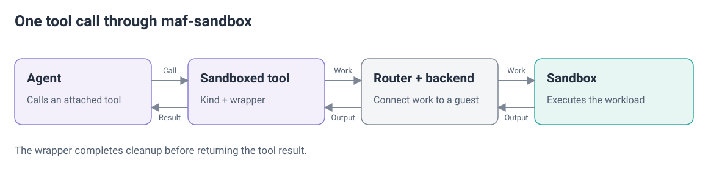

# Tool-call lifetime and cleanup

A **tool call** is one execution of a tool function with a particular set of arguments. For example, each time an agent asks the Bicep tool to validate a file, it makes a separate call, even if the same tool or sandbox is used again.

The application attaches a kind's tools to its MAF agent, so an ordinary tool call enters the `maf-sandbox` wrapper. The kind sends its work through the router and a backend to the sandbox; the wrapper returns the result after cleanup.



The router defaults to disposal. A host must explicitly enable reuse. Sharing scope and cleanup are separate settings: conversation scope permits sharing, while the cleanup policy decides what remains after active calls finish.

## Four lifetimes

```
binding    one per tool               process           SandboxToolSession
  └ call   one per tool call          the call          ← owns its own guest path
      └ run   0..1, transport only    inside a call     GuestRunLayout, reclaim_run

sandbox    one per (scope, thread_id, agent_id, kind)   conversation
             ...and per call_id too at IsolationScope.CALL   the call
```

| Object | Owns | Lifetime |
|---|---|---|
| Binding | Host configuration: router, spec, context accessors, logger and sink | Attached tool |
| Call | Current caller context, guest path and acquired instances | One tool call |
| Run | Supervised program and transport files | Inside a call that uses host tools |
| Sandbox | Execution boundary and storage base | Determined by sharing scope and cleanup |

One binding can serve many conversations. Several tools can use the same conversation sandbox. The sandbox therefore sits beside the binding/call/run chain, rather than containing it.


## Binding and call state

The tool wrapper owns per-call state and cleanup. A kind asks for a guest path, runs its workload and collects its outputs. The wrapper cleans up in a `finally`, including after refusals, exceptions and cancellation.

The binding stores only host configuration. Scope, thread and file listing come from host callables when the tool runs. The model never supplies the sandbox key.

`guest_call_path()` allocates and remembers a relative path for the current call. Repeated requests in that call return the same path. Asking outside a call or after it closes raises a wiring error.

Private `ContextVar` state keeps concurrent calls separate. It records the binding owner, path, acquired instances and whether the call has closed. A call can acquire more than one instance, so cleanup records the actual instances it used.

A child task inherits the call context. It cannot keep using that record after the wrapper has closed the call. Do not store caller state on the shared binding or expose a call object in the tool's JSON arguments.

`run` means the supervised transport program. These framework concepts live in `maf.py`; the backend protocol does not require a kind-specific call object.

## Cleanup, as a consequence

| Operation | Effect | Backend requirement |
|---|---|---|
| `RECLAIM` | Remove the call directory; other sandbox state can remain | `Capability.RECLAIM` |
| `RESET` | Restore a baseline taken before any input reached the sandbox | `Capability.SNAPSHOT` and `reset` |
| `DISPOSE` | Delete the instance; later work creates another | Always available |

`SandboxRouter(min_cleanup=...)` defaults to `DISPOSE`. `SandboxSpec.min_cleanup` may raise the host's floor, never lower it. The router chooses the weakest available operation at or above the effective floor; `effective_cleanup(spec)` exposes that choice.

For example, a host allowing `RECLAIM` gets `RESET` or `DISPOSE` if the backend cannot reclaim. `IsolationScope.CALL` always disposes its instance.

`confined_to_guest_call_path` is advisory information about the kind. It neither proves that the sandbox is clean nor enables reuse. A host that opts into reuse accepts residual filesystem and process state, including when running arbitrary code.


Directory reclamation requires a framework-created, unguessable path. Core refuses the working directory itself and paths fewer than two components from root. The backend must also establish safe reach through the ancestors. A missing directory is success; other failures raise.

`reclaim` is framework cleanup. `remove` serves workload-selected paths under `FILES_DELETE`. Neither operation gets extra authority because the host enabled reuse. ACAS and WSLC withhold `RECLAIM` and use disposal.

A call that requests no path has no directory to reclaim. A synchronous body cannot acquire through the async session. An async tool with the guest root as its base is refused because a child there would fail the cleanup reach rule.

## Unfamiliar instances

The router does not trust an instance it has not previously served. Before using an unfamiliar conversation instance, it resets it if a snapshot is available. Otherwise it disposes it and acquires a fresh instance once.

A failed reset falls back to disposal. Both operations are bounded by the cleanup timeout. First acquisitions for a key and kind are coordinated so concurrent callers do not each adopt the same instance.

The protocol has no create-or-reuse result flag. A new conversation can therefore pay for an initial create, disposal and second create. The second acquire is trusted because disposal succeeded. Call-scoped instances skip this adoption step.

## Cleanup failures

A failed reclaim, unusable launcher receipt, unavailable process check, refused signal or observed running survivor enters the cleanup-failure policy. The default `FailedReclaimPolicy.DISPOSE` disposes the exact backend and instance used by the call.

`KEEP` explicitly permits retaining an instance after failure. It does not enable ordinary reuse by itself; the host must also lower `min_cleanup`.

`on_reclaim_failure` runs after the router has acted. `ReclaimFailure.disposal` reports `disposed`, `failed` or `kept`. Use the callback for logging and alerts. A callback exception is logged and does not replace the tool result.

Backend disposal is best-effort and reports uncertainty through `DisposalFailure`, rather than raising. `dispose_scope` returns a `ScopePurge`. Codes distinguish `unreachable`, `timeout`, `refused`, `unlisted` and `unknown`; details remain in host logs.

If exact-instance disposal fails, the router retains the cleanup target and refuses the whole key with `SandboxUnclean`. The exception exposes a stable code and a fixed model-safe message. It does not expose backend details or endpoints.

A successful retry clears only the targets it covers. Newer or unrelated failures remain. [Operations](operations.md) defines host recovery and scope cleanup. A `None` backend disposal result means no reported failure; it is not independent proof of deletion.

## Process cleanup and observations

The host-tools launcher emits a versioned receipt with the program PID and optional dedicated process-group ID. A trusted helper waits until the host has received the complete receipt, then starts the guest program. Missing or invalid receipts leave it unreleased.

Cleanup uses that retained receipt on every exit path. Guest-writable PID files are diagnostic only. The transport collects the program result before signalling, then independently attempts transport-directory cleanup. The kind can collect artifacts before the wrapper reclaims the call directory.

Bounded Linux `/proc` observations surround launch and cleanup. They track observed `(PID, start ticks)` identities and descendants, distinguish preexisting processes and exclude zombies from running survivors. A process that merely appears between scans is not automatically a signal target.

Process cleanup has a five-second budget for observation, signalling and verification. Pre-signal observation can use at most one quarter of it. Directory reclamation has its own bound and still runs after the process budget expires.

These are guest-observed diagnostics. They can miss short-lived parents or hidden descendants, and numeric process IDs can change between checking and signalling. An empty final snapshot or successful group signal does not prove complete cleanup. See [process observations](observability.md#process-observations).

## Concurrency

Conversation-scoped calls share the sandbox. Separate call directories prevent accidental collisions; they do not prevent a program reading a sibling's files.

Ordinary bodies may overlap regardless of their final cleanup operation. Reclaim runs against the call's own directory. Reset, disposal and failed-reclaim escalation wait for the last active sibling.

The gate has three states: serving, draining and cleaning. Queuing whole-instance cleanup stops new admission. The last active call performs the queued work. Admission reopens only after each target succeeds or reaches the failure record.

Pending work is keyed by backend and physical instance. Requests for one instance combine to the strongest cleanup operation. A cancelled waiter does not discard cleanup. Unfinished targets remain recorded if cleanup is cancelled.

### Exclusive calls

`SandboxSpec.exclusive_admission` prevents bodies of that kind from overlapping through the router. CodeAct requests it because arbitrary code can read outside its own directory. A backend can require it through `requires_exclusive_admission` or the optional `BackendCallAdmission` hook.

Admission waits are bounded. The per-tool `admission_timeout` covers each call ahead and its bounded cleanup; progress restarts the wait budget. A waiter that exceeds its bound returns busy. A finished call also waits for its pending cleanup before reporting the outcome.

The optional backend hook holds ownership from before acquisition through output delivery and cleanup. Hyperlight uses it to coordinate all its backend objects and event loops in the process. Its backend admission timeout is a total bound.

The ordinary router gate does not coordinate other routers or processes. Use `min_isolation_scope=IsolationScope.CALL` when several replicas may serve the same conversation concurrently. A backend must declare call scope and include the host-minted call ID in its sandbox identity.

### Check cleanup claims

`assert_nothing_left_behind` compares an engine fingerprint before a workload and after its cleanup. It checks changed paths and running-process identities. A dirty initial filesystem or incomplete engine view fails the check; an unsupported view skips it.

A passing probe covers that workload and measurement. It does not prove confinement of arbitrary programs, kernel state or open sockets. The fake backend cannot provide that evidence. [Docker](backends/docker.md) documents its engine-backed measurements.

## Where the base comes from

The backend allocates the storage base, or honors an explicit `work_dir`. `guest_call_path()` returns a relative child. The framework reclaims it against `working_directory="."`.

The [host guide](hosts.md#where-the-storage-base-comes-from) covers allocation, image overrides and launcher paths. Kinds do not need to discover an absolute guest root.

## Status

| Decision | State | Tracking |
|---|---|---|
| Per-call path and wrapper cleanup | Implemented | [#496](https://github.com/sokolaidev/maf-extensions/pull/496) (merged); [#500](https://github.com/sokolaidev/maf-extensions/pull/500) (merged) |
| Cleanup floors and explicit host reuse | Implemented; disposal is the default | [#979](https://github.com/sokolaidev/maf-extensions/issues/979) (closed); [#463](https://github.com/sokolaidev/maf-extensions/issues/463) (closed); [#1091](https://github.com/sokolaidev/maf-extensions/pull/1091) (merged) |
| Unfamiliar-instance cleanup and sibling admission | Implemented | [#1045](https://github.com/sokolaidev/maf-extensions/pull/1045) (merged); [#1060](https://github.com/sokolaidev/maf-extensions/pull/1060) (merged); [#1065](https://github.com/sokolaidev/maf-extensions/pull/1065) (merged) |
| Failure callbacks, disposal and key refusal | Implemented | [#520](https://github.com/sokolaidev/maf-extensions/issues/520) (closed); [#677](https://github.com/sokolaidev/maf-extensions/issues/677) (closed); [#617](https://github.com/sokolaidev/maf-extensions/issues/617) (closed); [#641](https://github.com/sokolaidev/maf-extensions/issues/641) (closed) |
| Backend-owned reclamation | Implemented; unsafe mechanisms refuse | [#477](https://github.com/sokolaidev/maf-extensions/issues/477) (closed) |
| Process cleanup observations | Implemented with the limits above | [Observability status](observability.md#status) |
| Per-call isolation | Implemented | [#436](https://github.com/sokolaidev/maf-extensions/issues/436) (closed) |
| Hyperlight reset and backend admission | Implemented | [#1223](https://github.com/sokolaidev/maf-extensions/pull/1223) (merged) |
| Workload cleanup conformance | Implemented; evidence depends on the subject and workload | [#1004](https://github.com/sokolaidev/maf-extensions/issues/1004) (closed); [#1027](https://github.com/sokolaidev/maf-extensions/pull/1027) (merged) |
